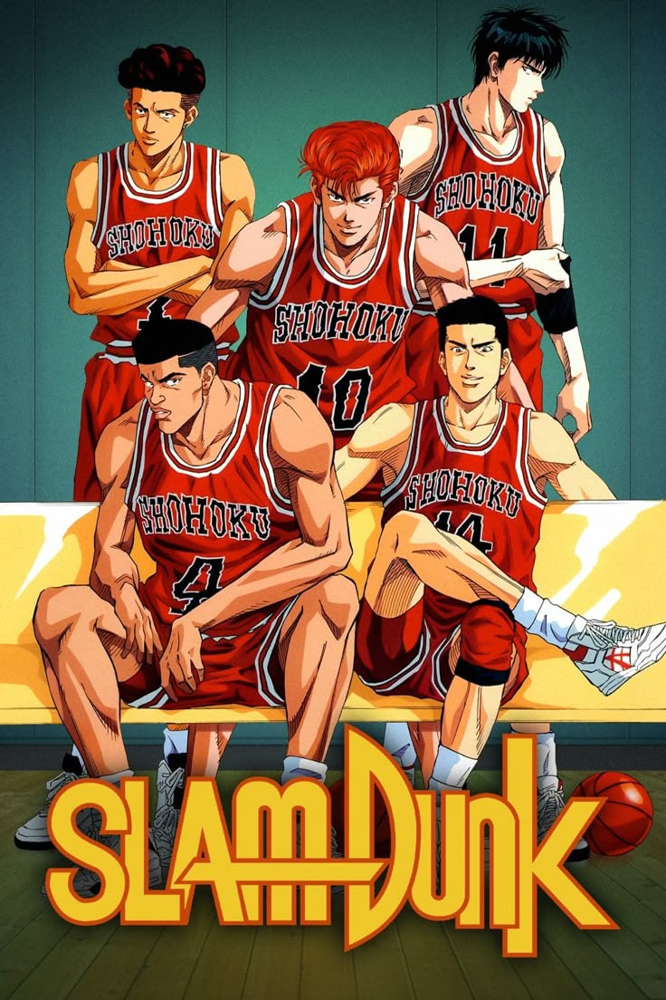

# WD-Seatwork-2  


**Slam Dunk Starting 5 Hero Section**

## 📝 Short Description:
A single-page hero section dedicated to the anime Slam Dunk. This project uses HTML and CSS to create a clean, modern design with interactive hover effects and character links. The layout captures the energy and emotion of Shohoku High's basketball team while demonstrating front-end development skills.

---

## 📘 Overview
This project is part of a Web Design seatwork focused on building a responsive and visually creative hero section using only HTML5 and CSS3. Featuring characters from *Slam Dunk*, the section includes styled elements, a short overview of the anime, image links to character pages, and a dynamic layout to enhance the user experience. No JavaScript or external frameworks were used. Ideal for showcasing layout design, hover interactivity, and thematic branding.

---

## 🧩 Key Components

- Hero section with custom background
- Character grid navigation
- Responsive design layout
- Hover effects and image transitions
- Clean semantic HTML5 and CSS3 styling

---

## 🛠️ Technology

- HTML
- CSS

---

## 🗂️ File Structure 
```
WD-SEATWORK-2
├── assets
│ ├── css
│ │ └── style.css
│ ├── img
│ │    ├── akagi.jpg
│ │    ├── akagi chibi.png
│ │    ├── akagi stats.png
│ │    ├── mitsui.jpg
│ │    ├── mitsui chibi.png
│ │    ├── mitsui stats.png
│ │    ├── rukawa.jpg
│ │    ├── rukawa chibi.png
│ │    ├── rukawa stats.png
│ │    ├── ryota.jpg
│ │    ├── ryota chibi.png
│ │    ├── ryota stats.png
│ │    ├── sakuragi.jpg
│ │    ├── sakuragi chibi.png
│ │    ├── sakuragi stats.png
│ │    ├── shohokugym.jpg
│ │    ├── slamdunk.jpg
│ │    └── slamdunk-bg.jpg
│ └── js
│ 

├── pages
│ ├── akagi
│ │    └── akagi.html
│ ├── mitsui
│ │    └── mitsui.html
│ ├── rukawa
│ │    └── rukawa.html
│ ├── ryota
│ │    └── ryota.html
│ └── sakuragi
│      └── sakuragi.html

├── index.html
├── LICENSE
├── README.md
└── structure.txt


